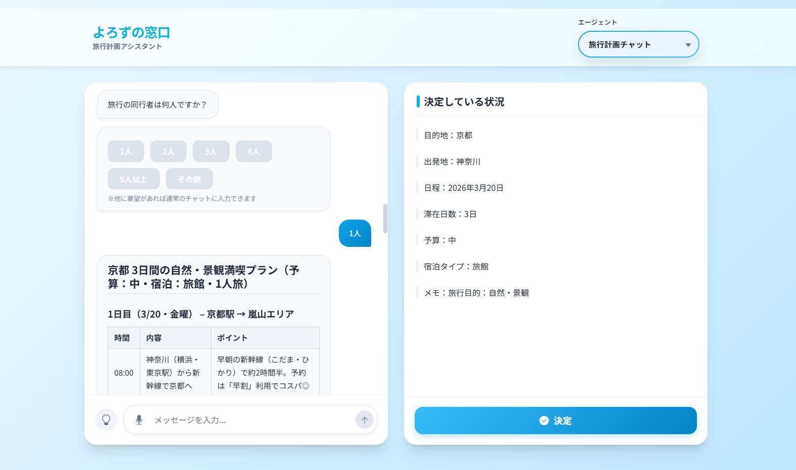

> 一番下に日本語版もあります

# 🌟 Yorozu Madoguchi (よろず窓口)


**Yorozu Madoguchi** is an AI-assisted travel planning web app where users chat with an assistant and receive personalized itineraries. It is designed to demonstrate end-to-end product thinking: conversational UX, robust backend services, and a modern frontend—all orchestrated with Docker Compose for easy onboarding.

## UI Preview

<p align="center">
  
</p>

## 🎬 Demo Video

ユーザーと旅行計画をしている様子です。Click a thumbnail to open the video on YouTube.

<a href="https://youtu.be/g3DgbxYkKDw">
  
</a>

## 🔎 Highlights (for recruiters)

- **Product-focused AI UX**: Converts free-form chat into actionable travel plans, showcasing how to bridge natural language input with structured outcomes.
- **Full-stack architecture**: React + Vite frontend, Flask API, PostgreSQL, and Redis wired together with Docker Compose for reproducible development.
- **Maintainability & growth-ready**: Clear service boundaries, environment-based configuration, and a containerized workflow that mirrors production practices.

## 🧰 Tech Stack

- **Frontend**: React, Vite (fast dev server, modern tooling)
- **Backend**: Python (Flask)
- **Data**: PostgreSQL, Redis
- **Infra**: Docker, Docker Compose

## ▶️ Quick Start (Docker Compose only)

> **Prerequisites:** Docker Desktop (or Docker Engine + Docker Compose plugin)

1. Create an environment file from the example:

```bash
cp .env.example .env
```

2. Build and start all services:

```bash
docker compose up --build
```

3. Open the app in your browser:

- **Frontend**: http://localhost:5173
- **Backend API**: http://localhost:5003

4. Stop the services when finished:

```bash
docker compose down
```

## 🧪 Tests

```bash
python -m unittest
```

## 📜 License

Apache License 2.0. See `LICENSE` for details.

---

<details>
<summary>日本語版（クリックして開く）</summary>

# 🌟 よろず窓口 (Yorozu Madoguchi)

**「よろず窓口」** は、AIとチャットしながら旅行プランを作成できるWebアプリです。会話形式のUXと、フロントエンド・バックエンド・データ基盤を一体化した構成により、プロダクトとしての完成度と拡張性を意識して設計しています。

## UI プレビュー

<p align="center">
  
</p>

## 🎬 デモ動画

ユーザーと旅行計画をしている様子です。サムネイルをクリックするとYouTubeで動画を開きます。

<a href="https://youtu.be/g3DgbxYkKDw">
  
</a>

## 🔎 就職活動向けのアピールポイント

- **会話UXの実装**: 自然言語の入力を、具体的な旅行プランに変換する設計で、ユーザー価値を意識したプロダクト開発力を示せます。
- **フルスタック構成**: React + Vite のフロント、Flask API、PostgreSQL/Redis を Docker Compose で統合。
- **運用に近い開発体験**: 環境変数管理・サービス分離・コンテナ化により、実運用を想定した開発フローを構築。

## 🧰 技術スタック

- **フロントエンド**: React, Vite
- **バックエンド**: Python (Flask)
- **データ基盤**: PostgreSQL, Redis
- **インフラ**: Docker, Docker Compose

## ▶️ 実行方法（Docker Composeで一本化）

> **前提:** Docker Desktop（または Docker Engine + Compose プラグイン）

1. `.env` を作成します。

```bash
cp .env.example .env
```

2. サービスを起動します。

```bash
docker compose up --build
```

3. ブラウザからアクセスします。

- **フロントエンド**: http://localhost:5173
- **バックエンド API**: http://localhost:5003

4. 終了時は次のコマンドで停止します。

```bash
docker compose down
```

## 🧪 テスト

```bash
python -m unittest
```

## 📜 ライセンス

Apache License 2.0（詳細は `LICENSE` を参照）

</details>
